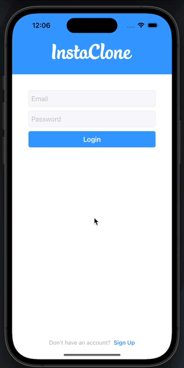

# Insta Clone App
This is a clone app of an older verison of Instagram (for a more simpler project) that incorporates a lot of iOS development concepts, swift frameworks, firebase, and much more!  
The purpose of this app was to showcase much of what I have learned in the past 7 months. While there are so many other features to add, I am happy where the app is currently and may possibly continue to build out the app. However, there's a better alternative called Instagram!  

### Features
- [x] Firebase
- [x] 100% programmatic code
- [x] Multiple swift dependency packages 
- [x] OOP encapsulation via dependecy injection 
- [x] custom delegation throughout the app
- [x] NotificationCenter obersvers
- [x] AVFoundation, specifically capture session
- [ ] Push Notifcations
- [x] Simple animations for a more refind ux
- [x] And much more

### Login & Signup

